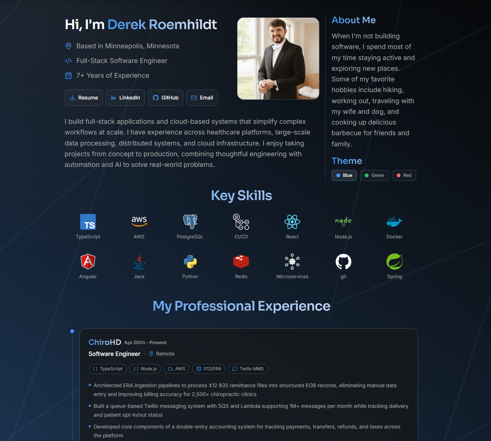

# Derek Dev Website

Personal portfolio site to showcase my professional experience, technical skills, and independent projects

## Live Website
**[https://www.derek-dev.com](https://www.derek-dev.com)**

## Tech Stack

- **Frontend:** React, TypeScript, Vite, Tailwind CSS
- **Infrastructure:** AWS CDK, S3, CloudFront, Route 53
- **CI/CD + Tooling:** GitHub Actions, pnpm, Biome

## Repo Structure

- `ui` - React application built with Vite
- `ui/src/pages` - Application pages and routing
- `ui/src/layouts` - Shared application layout
- `ui/src/components` - Reusable UI components
- `ui/resources` - Static assets, profile image, and resume
- `infra` - AWS CDK infrastructure
- `.github/workflows/deploy.yml` - Automated deployment workflow

## Local Development

**Prerequisites**

- Node.js `24.12.0`
- pnpm `10.28.2`
- AWS CLI configured for deployments
- AWS SSO access for the `DRoemhildt19` profile when deploying locally

From the repository root:

- `pnpm install` - Install dependencies
- `pnpm run local` - Start the local Vite development server

## Validation

- `pnpm run typecheck` - Run TypeScript checks for all workspace packages
- `pnpm run build` - Build all workspace packages, including the Vite production build
- `pnpm run format` - Run Biome and write formatting fixes

## Infrastructure

The CDK app lives in `infra` and defines the `derek-dev-website-ui` stack. It deploys the built UI from `ui/dist`.

The stack creates:

- Private S3 bucket for static site assets
- CloudFront distribution with Origin Access Control
- ACM certificate for the primary domain and `www` domain
- Route 53 A and AAAA alias records for both domains
- SPA fallback responses that serve `index.html` for CloudFront 403 and 404 responses
- Bucket deployment with CloudFront invalidation

## Deployment

### Automated (GitHub Actions)

The workflow is triggered by pushes to `main` and can also be started manually from GitHub Actions.

- Installs Node.js and pnpm
- Installs dependencies using `pnpm install --frozen-lockfile`
- Assumes the AWS IAM role configured in `AWS_DEPLOY_ROLE_ARN`
- Executes `pnpm run github-action-deploy`
- Deploys to AWS `us-east-1`

### Manual (AWS SSO)

For local deployments, authenticate with AWS SSO and deploy using:

- `pnpm run sso` - Authenticate with AWS SSO
- `pnpm run diff` - Preview infrastructure changes
- `pnpm run deploy` - Deploy the CDK stack
